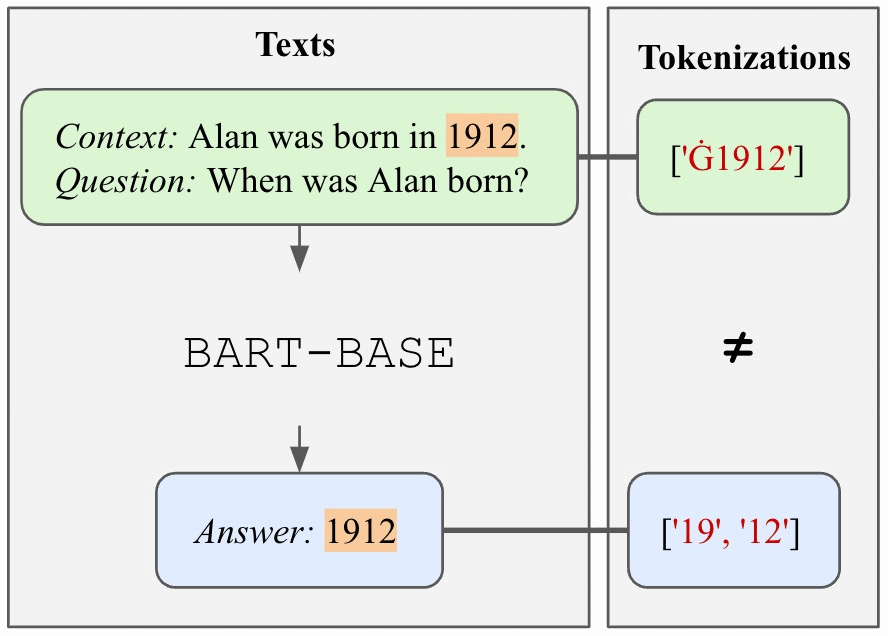
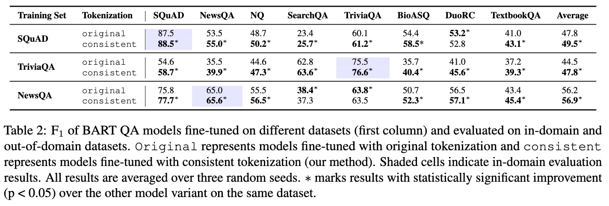

This repository include the code to replicate experiments in [Tokenization Consistency Matters for Generative Models on Extractive NLP Tasks](https://arxiv.org/abs/2212.09912), published in EMNLP 2023 Findings.


## Code base strucutre
* `exp_scripts/` includes the bash scripts in order to train the models, evaluate the models, and compute model confidence on gold answers.
    * `train/` includes the scripts for training, either training extractive/generative model or fixing tokenizer training.
    * `eval/` includes the scripts for evaluation and computing model confidence.

* `post_eval_analysis/` is the core directory hosting analysis code. All the analysis functions are included in `post_eval_analysis/utils/`. The `.ipynb` file call the functions in `utils` to run experiments.

    * `gen_plot.ipynb` includes the generlizability plots - it will plot the figure where the x-axis is in-domain performance and y-axis is OOD performance.
    * `tokenizer_analysis_plot.ipynb` includes the analysis and plotting for our experiments of consistent v.s. inconsistent tokenization.

* `qa_utils/` includes the file to convert huggingface MRQA dataset into our desired format and the trainer override for training QA models.
* `run_fixed_gen_qa.py` is file to train generative QA models with consistent tokenization. It can train any generative models that has `FastTokeizer`.
* `run_unfixed_gen_qa.py` is file to train generative QA models with original tokenizaion.
* `confidence_stat.py` is the file to compute a model's confidence in predicting gold answers on the given datset.
* `tokenizer_stat.py` is used to compute the percentage of instances in a model that has inconsistent tokenization issue.

The following folders will be created while running the scripts:

* `data/` is used to store data.
* `logs/` is used to store training/evaluation logs.
    * `logs/training`
        * Under this directory, create dirctory for whatever training dataset (base dataset) you are using. e.g. `logs/training/squad/`. If the model name you use is under some other subfolder, like `facebook/bart-base`, create a `facebook` directory under `squad`.
    * `logs/test`
        * Do the same thing as for the `training/` dir.
* `post_eval_analysis/output/` will be the directory to store some hallucination analysis and behavior analysis results.
* `post_eval_analysis/perf_outputs/` is the directory to store overall model performance csv file.
* `results/` hosts the evaluation results output by the model.
    * Under it you should create a subdirectoy with the name to be the base dataset. e.g. `results/squad/`
* `trained_models` is the place to store trained models.
    * Under it you should create a subdirectoy with the name to be the base dataset. e.g. `results/squad/`

## Dependencies
```
conda env create --file=environments.yml
```

## Data preparation
To run the code, the datasets will be converted into the same format using following command. By default, the script will convert the datasets in MRQA into preferable format and store them in `data/`.

```
export BASE_DIR=/path/to/repository
cd $BASE_DIR
mkdir data/
python qa_utils/load_data_utils.py
```
Using this script, you will be able to convert all datasets available in MRQA (SQuAD,
NewsQA,
TriviaQA,
SearchQA,
HotpotQA,
NaturalQuestions,
BioASQ,
DROP,
DuoRC,
RACE,
RelationExtraction,
TextbookQA) in [Huggingface Hub](https://huggingface.co/datasets/mrqa). For experiments, we used SQuAD,
NewsQA,
TriviaQA,
SearchQA,
NaturalQuestions,
BioASQ,
DuoRC. Please cite the corresponding dataset authors if any of them are used.

## Model Training
The script support training generative QA models available in Huggingface Hub. Specifically, `bart-base` was used for experiments. Below is an example of training `bart-base` on SQuAD with consistent tokenization.

```
bash exp_scripts/train_model.sh

Using consistent tokenization or not (y/n)? y
Enter the model name to train (e.g. facebook/bart-base, t5-base, google/t5-v1_1): facebook/bart-base
Enter the GPUs to train on. Use comma to separate but do not include white space (e.g. 0,1): 0,1,2,3
Enter the training dataset name: squad
Enter the learning rate: 1e-3
Enter the batch size:  1
Enter the random seed:  0
```
With 4 Nvidia 16GB V100 GPUs, the training for BART should be done within 5 hours for 10 epochs.

## Evaluation
To evaluate a model on all available datasets for one random seed, run the script below and input the corresponding prompt as example above.

```
bash exp_scripts/eval_single_model.sh
```

To evaluate a model on all random seeds, use `eval_model_in_bulk.sh`. By default, it will evaluate on random seeds used in paper ([0, 42, 12345]). To obtain a table like the one below, you should also use the Jupyter notebook in `post_eval_analysis/` mentioned below to generate the `.csv` files.



## Analysis experiments
All analyais code are hosted in `post_eval_analysis/`. To replicate each experiment in specific, use the `.ipynb` file and follow each section.

Before running analysis, evaluation scripts need to be ran for any target datasets.

### Model confidence
To replicate the model confidence experiment, a round of inference need to be ran first using the following commands:

```
mkdir post_eval_analysis/output/
bash compute_conf.sh
```

## Security

See [CONTRIBUTING](CONTRIBUTING.md#security-issue-notifications) for more information.

## License

This project is licensed under the Apache-2.0 License.

## Cite this work

If you use ConsistentTokenization in your work, please kindly cite our EMNLP Findings 2023 paper

```
@inproceedings{sun-etal-2023-tokenization,
    title = "Tokenization Consistency Matters for Generative Models on Extractive {NLP} Tasks",
    author = "Sun, Kaiser  and
      Qi, Peng  and
      Zhang, Yuhao  and
      Liu, Lan  and
      Wang, William  and
      Huang, Zhiheng",
    editor = "Bouamor, Houda  and
      Pino, Juan  and
      Bali, Kalika",
    booktitle = "Findings of the Association for Computational Linguistics: EMNLP 2023",
    year = "2023",
    url = "https://aclanthology.org/2023.findings-emnlp.887",
    doi = "10.18653/v1/2023.findings-emnlp.887"
}
```